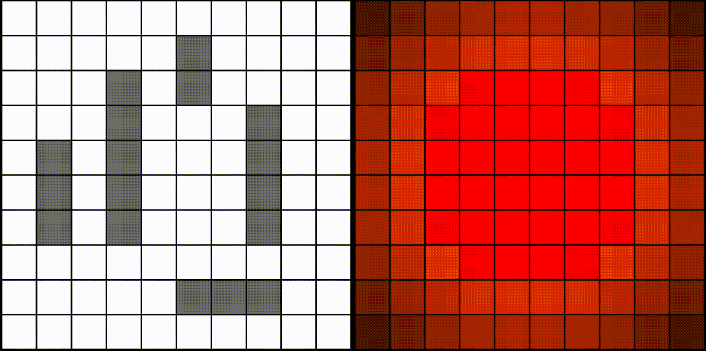
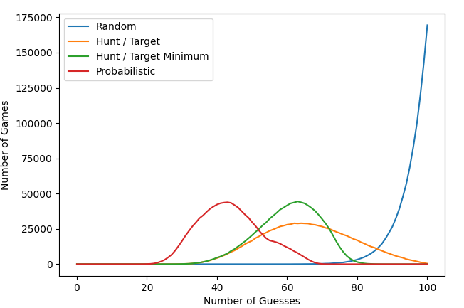

# Battleship-AI

This is an implementation of a variety of Battleship strategies spelled out in [this article](https://www.datagenetics.com/blog/december32011/) by Nick Berry of DataGenetics.

  

  

The default strategy for the AI is the optimal probabilistic strategy, but I've included all the other strategies Nick talked about in his post as well: Random, Hunt/Target, and Hunt/Target Minimum.

## Setup

If you just want to see the algorithm in action, the only necessary file is battleship_pg.py. Just make sure you have numpy and pygame installed. If you want to play with the data from simulations, I have them stored as .pickle files in the stored_objects folder. Graphs can be recreated using the plotting.py file, which requires matplotlib and seaborn.

